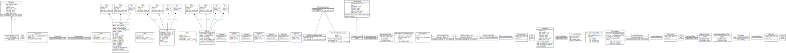
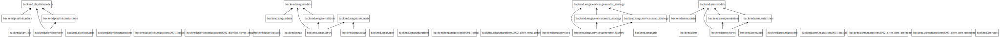
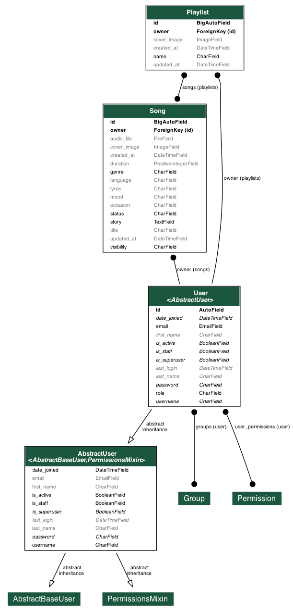

# AI Song Generation Platform

**AI Song Generation Platform** empowers users to generate custom songs using AI by simply providing details like genre, mood, lyrics, and story. From there, it tracks generation progress, saves the completed audio for offline listening, and allows users to build personalized playlists. 

## Prerequisites
- **Python 3.10 - 3.12** (*Note: Due to a `psycopg2` dependency, Python 3.13+ or 3.14 may cause installation errors. Please use Python 3.12 or earlier.*)
- **PostgreSQL 15+**

## How to Run the Project

1. **Clone the repository and set up a Virtual Environment:**
   ```bash
   git clone https://github.com/pmperpm/AI-Song-Generation-Platform.git
   cd AI-Song-Generation-Platform/backend
   # Make sure you are using Python 3.12 or earlier
   python3 -m venv venv
   source venv/bin/activate
   ```

2. **Install Dependencies & Environment:**
   ```bash
   pip install -r requirements.txt
   # Copy the example env file to set up your environment variables
   cp .env.example .env
   ```
   *(Optional: Open the newly created `.env` file to add your `SUNO_API_KEY` if you plan to use the real API instead of the mock).*

3. **Database Configuration:**
   Ensure PostgreSQL is running locally on port `5432` with a database named `ai_song_generation_platform`. Use `postgres` as both the default username and password (or change these in a `.env` file).

   To quickly create the database via CLI, you can run:
   ```bash
   psql -U postgres -c "CREATE DATABASE ai_song_generation_platform;"
   ```

4. **Apply Migrations (Build the Database):**
   ```bash
   python3 manage.py makemigrations
   python3 manage.py migrate
   ```

5. **Create a Superuser (Admin Access):**
   ```bash
   python3 manage.py createsuperuser
   ```
   *Follow the prompts (Username, Email, Role).*

6. **Run the Server:**
   ```bash
   python3 manage.py runserver
   ```
   backend will now be live at `http://localhost:8000/`.

7. **Run the Frontend Page:**
   ```bash
   cd frontend
   python3 -m http.server 3000
   ```
   frontend will now be available at `http://localhost:3000/`.

---

## Generator Strategy Configuration

This project uses the **Strategy Pattern** to swap out the AI generation backend. You can run it in two modes: `mock` (for offline testing) or `suno` (for real API integration).

### 1. How to run Mock Mode (Default)
By default, the application runs in Mock mode. It will instantly return a dummy task and wait 5 seconds before downloading a sample audio file. 
You can explicitly set this in your `backend/.env` file:
```env
GENERATOR_STRATEGY=mock
```

### 2. How to run Suno API Mode
To hit the real Suno API (api.sunoapi.org), you need to change the strategy in `backend/.env` and supply your real API key:

```env
GENERATOR_STRATEGY=suno
SUNO_API_KEY=your_real_api_key_here
```

### 3. Running the Async Background Worker
Because both strategies take time to run, they are processed asynchronously. 
**You must run Redis and Celery alongside your Django server:**

1. Start Redis: `redis-server`
2. Start Celery (in a new terminal):
   ```bash
   cd backend
   celery -A celery_app worker --loglevel=info
   ```

## Google OAuth Configuration (Authentication)

This project uses `dj-rest-auth` + `django-allauth` to support Google OAuth. Since we don't have passwords for local users, Google OAuth generates a valid Token API to log in.

### 1. Set up Google Cloud Console
1. Go to the [Google Cloud Console](https://console.cloud.google.com/).
2. Create your project and go to **APIs & Services > Credentials**.
3. Create **OAuth Client ID** (Type: Web Application).
4. Complete the **Authorized JavaScript origins**:
   * `http://localhost:3000`
   * `http://127.0.0.1:3000`
5. Complete the **Authorized redirect URIs**:
   * `http://localhost:3000` (Or `http://localhost:3000/auth/callback` depending on how your frontend router is setup).
   * Note: The Django backend won't intercept the raw redirect. The React/Vue frontend intercepts it and sends the `access_token` to `/api/auth/google/`.
6. Copy your **Client ID** and **Client Secret**.

### 2. Configure Django Settings
Inside `backend/.env`, add:
```env
GOOGLE_CLIENT_ID=your_google_client_id.apps.googleusercontent.com
GOOGLE_CLIENT_SECRET=your_google_client_secret
```

**Without OAuth:** Users can still register with email/password.

---

## CRUD Operations 

All Create, Read, Update, and Delete operations are performed inside the **Django Admin Interface**. 

Navigate to **http://127.0.0.1:8000/admin/** and log in with your Superuser.

### Users (`/admin/users/user/`)
* **Create/Update:** Add users without passwords (setup for Google OAuth integration). Assign roles (User vs Admin).
* **Read:** Easily seek users by email.
* **Delete:** Remove accounts and automatically cascade deletions for all their songs.

### Songs (`/admin/songs/song/`)
* **Create:** Simulate generating a song. It must be attached to an owner.
* **Update:** Alter visibility (Private/Public) or add custom cover artwork.
* **Read:** Filter tracks securely by Status (`Generating`, `Complete`, `Fail`), or by Visibility.
* **Delete:** Administrators can delete generated media in case of violations.

### Playlists (`/admin/playlists/playlist/`)
* **Create/Update:** Select your previously generated tracks using the horizontal selection menu.
* **Validation:** The system strictly checks to make sure songs belong to the Playlist owner and possess a status of `Complete`.
* **Read/Delete:** Keep track of personal library structures. Deleting a playlist never deletes the origin songs.

### CRUD Operation Video and API Screenshots
[AI Song Generation Platform Folders](https://drive.google.com/drive/folders/1rDlD28AFEa1Xlzm_DTEQohkNDBt1tzZX?usp=share_link)

### Suno API
[Suno API demo video](https://drive.google.com/file/d/14voZNByJGRDMfkUCZM0dgVU3KpHT201v/view?usp=sharing)

### Mock Strategy
[Mock API video with Postman](https://drive.google.com/file/d/1bfjSKXrCJrO5Zln6MxI05ggO6w2bwfLR/view?usp=share_link)

### Class Diagram
## Full Class Diagram


## Packages


## Class Diagram(models)


